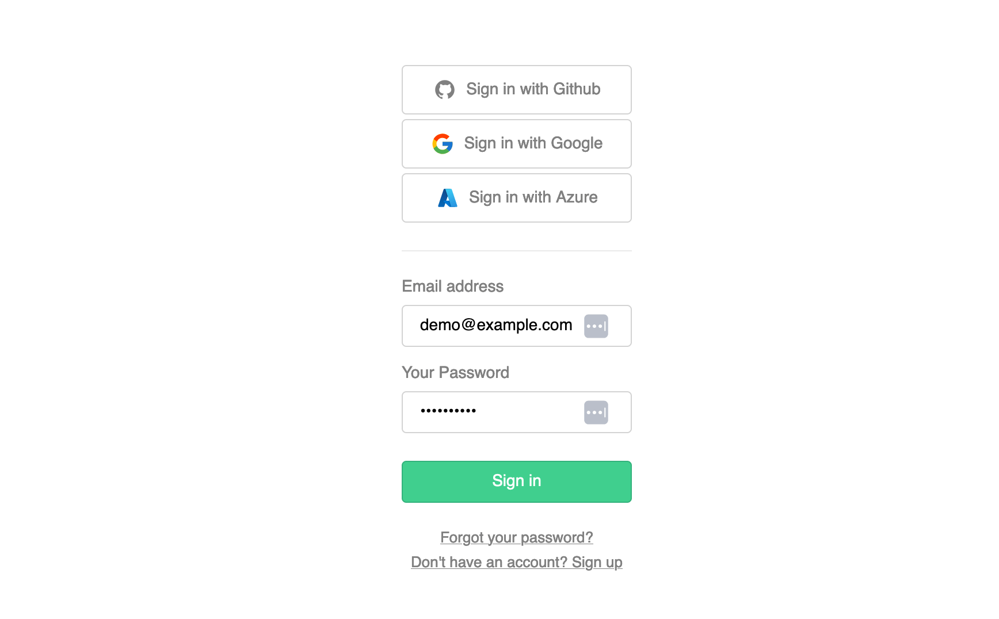
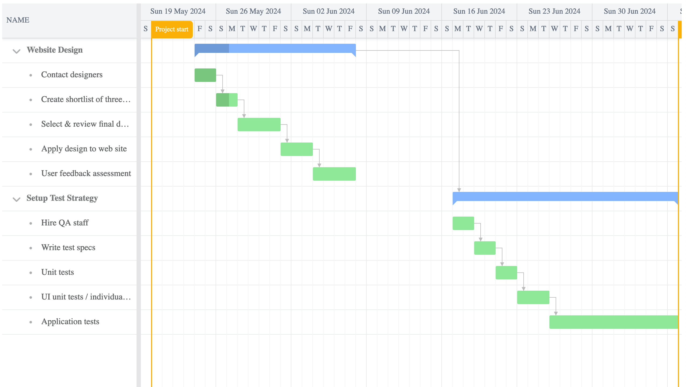

# How to use Supabase Edge Functions to build a Bryntum Gantt chart in React

The [Bryntum Gantt](https://bryntum.com/products/gantt/) is a feature-rich and performant component for creating interactive Gantt charts in web applications.

In this post, we'll show you how to integrate Bryntum Gantt with a Supabase Postgres database. We'll use Supabase Edge Functions to interact with the database and Supabase Auth with row-level security (RLS) enabled for authorization.

## Prerequisites

To follow along with this guide, you'll need:

- A Supabase account. Create one [here](https://supabase.com/dashboard/sign-in?returnTo=%2Fprojects).
- A running React app. Use our quickstart guide [here](https://bryntum.com/products/gantt/docs/guide/Gantt/quick-start/react) to set up a Bryntum Gantt React project.
- A Bryntum Gantt license, or [sign up for a free trial version](https://bryntum.com/download/).

## Create a Supabase project

In your Supabase organization dashboard, click **New project** to create a new project.


Give your project a name, set a password for the database, select a region, and click **Create new project**.


You'll need the reference ID and API key for your new project.

Find the reference ID in the project settings under **General**.


To find the API key, select **API** from the sidebar. You will see the `anon` `public` project API key.


## Create a new Supabase user

Navigate to the **Authentication** tab and click **Add user** to create a new user.


Take note of the new user's email and password to use later.

## Create new database tables

Navigate to the SQL Editor tab.

Click **+ New query** from the sidebar and paste the following SQL commands into the editor:

```sql
-- Create the tasks table
CREATE TABLE tasks (
    id INT PRIMARY KEY,
    name VARCHAR(255),
    "percentDone" INT,
    "startDate" DATE,
    "endDate" DATE,
    rollup BOOLEAN,
    expanded BOOLEAN,
    "parentId" INT
);

-- Insert data into the tasks table
INSERT INTO tasks (id, name, "percentDone", "startDate", "endDate", rollup, expanded, "parentId") VALUES
(1, 'Website Design', 30, '2024-05-20', '2024-06-14', TRUE, TRUE, NULL),
(2, 'Contact designers', 100, '2024-05-24', '2024-05-26', NULL, NULL, 1),
(3, 'Create shortlist of three designers', 60, '2024-05-27', '2024-05-29', NULL, NULL, 1),
(4, 'Select & review final design', 0, '2024-05-30', '2024-06-03', NULL, NULL, 1),
(5, 'Apply design to web site', 0, '2024-06-04', '2024-06-07', NULL, NULL, 1),
(6, 'User feedback assessment', 0, '2024-06-10', '2024-06-14', NULL, NULL, 1),
(7, 'Setup Test Strategy', 0, '2024-06-17', '2024-06-28', NULL, TRUE, NULL),
(8, 'Hire QA staff', 0, '2024-06-17', '2024-06-19', NULL, NULL, 7),
(9, 'Write test specs', 0, '2024-06-19', '2024-06-21', NULL, NULL, 7),
(10, 'Unit tests', 0, '2024-06-22', '2024-06-24', NULL, NULL, 7),
(11, 'UI unit tests / individual screens', 0, '2024-06-25', '2024-06-28', NULL, NULL, 7),
(12, 'Application tests', 0, '2024-05-21', '2024-06-02', NULL, NULL, 7);

-- Create the dependencies table
CREATE TABLE dependencies (
    id INT PRIMARY KEY,
    "fromEvent" INT,
    "toEvent" INT
);

-- Insert data into the dependencies table
INSERT INTO dependencies (id, "fromEvent", "toEvent") VALUES
(1, 2, 3),
(2, 3, 4),
(3, 4, 5),
(4, 5, 6),
(5, 1, 7),
(6, 8, 9),
(7, 9, 10),
(8, 10, 11),
(9, 11, 12);
```
**Note:** the `"` around some column names, Postgres by default names database tables and columns without any capitalization which will cause the Gantt chart to not behave as expected. Wrap all the column names that have capitals with quotes to prevent these issues from occurring.

Click **Run** to run the queries, two tables will be created and populated with data.

## Enable RLS on the new tables

Let's enable RLS on the new tables. In the **Authentication** tab, select **Policies** from the sidebar. Click **Enable RLS** for the new tables.


Now click **Create policy**. In the dialog that opens, give the new policy a name and select authenticated on target roles. Click **Save policy** to save the policy for each table.


This policy allows only authenticated users to read the data in the table. Users can be assigned policies that dictate their access to specific rows in tables.

You'll need to follow the same process for every table you add that you would like authenticated users to access. Tables with RLS enabled and no policies assigned will not allow any user, except the superuser, to access the table data.

## Use Supabase CLI to develop an Edge Function

You can use the Supabase CLI to manage instances, develop and deploy projects, handle migrations, and generate native data types.

Access the Supabase CLI in your shell environment using package managers for macOS, Windows, Linux, and npm or Bun. This guide assumes you're using npm as your package manager. For other package managers, consult the [Supabase CLI documentation](https://supabase.com/docs/guides/cli/getting-started?queryGroups=platform&platform=macos#installing-the-supabase-cli), but the basics will remain the same.

Let's use the Supabase CLI to create a new Edge Function.

To create a new Supabase project, run the following command from your terminal inside the directory you want your project to live:

```sh
npx supabase init
```

Now create a new Edge Function:

```sh
npx supabase functions new tasks-rest
```

Open the `functions/tasks-rest/index.ts` file that was just created, clear everything, and add the following:

```ts
import { createClient, SupabaseClient } from 'jsr:@supabase/supabase-js@2'

const corsHeaders = {
  'Access-Control-Allow-Origin': '*',
  'Access-Control-Allow-Headers': 'authorization, x-client-info, apikey, content-type',
  'Access-Control-Allow-Methods': 'POST, GET, OPTIONS, PUT, DELETE',
}

interface Task {
  name: string
  status: number
}
```

You configured CORS headers to allow cross-site traffic, authorization headers, api key, content type, and the `POST`, `GET`, `OPTIONS`, `PUT`, and `DELETE` methods. This allows you to use this Edge Function as a RESTful API that can be called using the appropriate URL of your edge function along with the appropriate pattern. You will see this once you have deployed the function to your Supabase project.

Now add the following code:

```ts
async function getAllGanttData(supabaseClient: SupabaseClient) {
  // Query the tasks table
  const { data: taskData, error: taskError } = await supabaseClient.from('tasks').select('*')
  if (taskError) throw taskError

  // Query the dependencies table
  const { data: dependencyData, error: dependencyError } = await supabaseClient.from('dependencies').select('*')
  if (dependencyError) throw dependencyError

  // Combine the results
  const responseData = {
    tasks: taskData,
    dependencies: dependencyData,
  }

  return new Response(JSON.stringify({ responseData }), {
    headers: { ...corsHeaders, 'Content-Type': 'application/json' },
    status: 200,
  })
}
```

This function you created is called when you make a `GET` request with no query parameters defined. It will query the tables we created, combine the results and return them.

You can define a function that will accept an `id` argument with:

```ts
async function getTask(supabaseClient: SupabaseClient, id: string) {
  const { data: task, error } = await supabaseClient.from('tasks').select('*').eq('id', id)
  if (error) throw error

  return new Response(JSON.stringify({ task }), {
    headers: { ...corsHeaders, 'Content-Type': 'application/json' },
    status: 200,
  })
}
```

Here you defined an async function that accepts an `id` parameter and uses the Supabase client to run the appropriate `select` query which then returns the response, or throws an error.

Add methods for the rest of the verbs you would like to handle from a request:

```ts
async function deleteTask(supabaseClient: SupabaseClient, id: string) {
  const { error } = await supabaseClient.from('tasks').delete().eq('id', id)
  if (error) throw error

  return new Response(JSON.stringify({}), {
    headers: { ...corsHeaders, 'Content-Type': 'application/json' },
    status: 200,
  })
}

async function updateTask(supabaseClient: SupabaseClient, id: string, task: Task) {
  const { error } = await supabaseClient.from('tasks').update(task).eq('id', id)
  if (error) throw error

  return new Response(JSON.stringify({ task }), {
    headers: { ...corsHeaders, 'Content-Type': 'application/json' },
    status: 200,
  })
}

async function createTask(supabaseClient: SupabaseClient, task: Task) {
  const { error } = await supabaseClient.from('tasks').insert(task)
  if (error) throw error

  return new Response(JSON.stringify({ task }), {
    headers: { ...corsHeaders, 'Content-Type': 'application/json' },
    status: 200,
  })
}
```

Next, add the code to start the [Deno](https://supabase.com/blog/edge-runtime-self-hosted-deno-functions) runtime:

```ts
Deno.serve(async (req) => {
  // Server logic here...
})
```

The rest of this code needs to be placed within the curly braces of the Deno function above.

Extract the URL and method from the received request:

```ts
const { url, method } = req
```

And set up the response for an `OPTIONS` request:

```ts
if (method === 'OPTIONS') {
  return new Response('ok', { headers: corsHeaders })
}
```

This returns the list of allowed verbs you added earlier that your edge function will accept.

Next, add a `try..catch` block that will house the rest of our server function:

```ts
try {
    // unsafe code here
} 
catch (error) {
  console.error(error)

  return new Response(JSON.stringify({ error: error.message }), {
    headers: { ...corsHeaders, 'Content-Type': 'application/json' },
    status: 400,
  })
}
```

This will catch any errors in the unsafe code, then return a status code and error message.

Inside the braces of your `try{}` block, first create a Supabase client:

```ts
const supabaseClient = createClient(
  // Supabase API URL - env var exported by default.
  Deno.env.get('SUPABASE_URL') ?? '',
  // Supabase API ANON KEY - env var exported by default.
  Deno.env.get('SUPABASE_ANON_KEY') ?? '',
  // Create client with Auth context of the user that called the function.
  // This way your row-level-security (RLS) policies are applied.
  {
    global: {
      headers: { Authorization: req.headers.get('Authorization')! },
    },
  }
)
```

The Deno runtime has access to the environment variables of your Supabase instance. Using the `SUPABASE_URL` and `SUPABASE_ANON_KEY`, along with authorization headers which will be received from the request, a Supabase client is created that will be used to interact with your database.

Then add a few constants that you will need:

```ts
const taskPattern = new URLPattern({ pathname: '/tasks-rest/:id' })
const matchingPath = taskPattern.exec(url)
const id = matchingPath ? matchingPath.pathname.groups.id : null
```

You first got the current user based on the requests' authorization header.
You then set up a URL pattern `/tasks-rest/:id`.
Then you matched the URL from the request to the pattern you created and stored the `id` from the query parameter if it has been given, otherwise `null`.

Now to assign the data to a variable when the request is a `POST` or `PUT`:

```ts
let task = null
if (method === 'POST' || method === 'PUT') {
  const body = await req.json()
  task = body.task
}
```

Finally, lets add a switch case that calls the correct method depending on the request verb, or simply return all data required for the Gantt chart:

```ts
switch (true) {
  case id && method === 'GET':
    return getTask(supabaseClient, id as string)
  case id && method === 'PUT':
    return updateTask(supabaseClient, id as string, task)
  case id && method === 'DELETE':
    return deleteTask(supabaseClient, id as string)
  case method === 'POST':
    return createTask(supabaseClient, task)
  case method === 'GET':
    return getAllGanttData(supabaseClient)
  default:
    return getAllGanttData(supabaseClient)
}
```

Your entire server function should look something like this:

```ts
Deno.serve(async (req) => {
  const { url, method } = req

  // This is needed if you're planning to invoke your function from a browser.
  if (method === 'OPTIONS') {
    return new Response('ok', { headers: corsHeaders })
  }

  try {
    // Create a Supabase client with the Auth context of the logged in user.
    const supabaseClient = createClient(
      // Supabase API URL - env var exported by default.
      Deno.env.get('SUPABASE_URL') ?? '',
      // Supabase API ANON KEY - env var exported by default.
      Deno.env.get('SUPABASE_ANON_KEY') ?? '',
      // Create client with Auth context of the user that called the function.
      // This way your row-level-security (RLS) policies are applied.
      {
        global: {
          headers: { Authorization: req.headers.get('Authorization')! },
        },
      }
    )

    // For more details on URLPattern, check https://developer.mozilla.org/en-US/docs/Web/API/URL_Pattern_API
    const taskPattern = new URLPattern({ pathname: '/tasks-rest/:id' })
    const matchingPath = taskPattern.exec(url)
    const id = matchingPath ? matchingPath.pathname.groups.id : null

    let task = null
    if (method === 'POST' || method === 'PUT') {
      const body = await req.json()
      task = body.task
    }

    // call relevant method based on method and id
    switch (true) {
      case id && method === 'GET':
        return getTask(supabaseClient, id as string)
      case id && method === 'PUT':
        return updateTask(supabaseClient, id as string, task)
      case id && method === 'DELETE':
        return deleteTask(supabaseClient, id as string)
      case method === 'POST':
        return createTask(supabaseClient, task)
      case method === 'GET':
        return getAllGanttData(supabaseClient)
      default:
        return getAllGanttData(supabaseClient)
    }
  } 
  catch (error) {
    console.error(error)

    return new Response(JSON.stringify({ error: error.message }), {
      headers: { ...corsHeaders, 'Content-Type': 'application/json' },
      status: 400,
    })
  }
})
```

### Deploy Edge Function

Generate the CLI access token by logging in:

```sh
npx supabase login
```

Now you can deploy the Edge Function to your Supabase project:

```sh
npx supabase functions deploy tasks-rest --project-ref <Project_Ref_Id>
```

Replace `<Project_Ref_Id>` with your Supabase project reference ID.

Navigate to your Supabase instance and you should see your new Edge Function deployed:


Here you can see the URL you can use to invoke your Edge Function.

Edge functions run server-side in your Supabase instance and enforce the security policies you stipulate to give you secure, low-latency access to the data stored in your Postgres database. Edge Functions can be configured in various ways and are easily adapted to perform a range of tasks or processes using any table or combination of tables.


## Add Bryntum Gantt to the React application

Now you can add Bryntum Gantt to your React application. If you don't have an existing React application ready, [these](https://bryntum.com/products/gantt/docs/guide/Gantt/quick-start/react) instructions should get you started quickly.

First, in your application's directory, configure npm to download the Bryntum packages in the `@brytum` scope from the Bryntum registry by following the instructions in our documentation [here](https://bryntum.com/products/gantt/docs/guide/Gantt/npm-repository).


Bryntum Gantt uses [Sass](https://sass-lang.com/) to apply CSS rules. Install the `sass` package now if you don't already have it:

```shell
npm install sass
```

Install the Bryntum React package:

```shell 
npm install @bryntum/gantt @bryntum/gantt-react
```

Finally, install the Supabase React Auth UI:

```sh
npm install @supabase/supabase-js @supabase/auth-ui-react @supabase/auth-ui-shared
```

Your application is now set up to use the Supabase login component and Bryntum Gantt.

## Connect to the Supabase Edge Function

Create a new utilities directory within the `src` directory of your code:

```sh
mkdir utils
```

In the `utils` directory add a new JavaScript file named `supabaseClient.js` inside the directory and paste the following into it, replacing `<Project_Ref_Id>` and `<Supabase_Anonymous_Key>` with your Supabase values:

```js
import { createClient } from '@supabase/supabase-js'

export const supabase = createClient('https://<Project_Ref_Id>.supabase.co', 
  '<Supabase_Anonymous_Key>'
)
```

Here you configured the client connection to the Supabase project, which will be used for all interactions with the Supabase instance. You'll use this client to call your edge function.


Find your `src/main.jsx` file and replace its contents with the following:

```jsx
import React from 'react';
import ReactDOM from 'react-dom/client';
import App from './App';
import { Auth } from '@supabase/auth-ui-react'
import { supabase } from './utils/supabaseClient'

const root = ReactDOM.createRoot(document.getElementById('root'));
root.render(
  <React.StrictMode>
    <Auth.UserContextProvider supabaseClient={supabase}>
      <App />
    </Auth.UserContextProvider>
  </React.StrictMode>
);
```

This code imports the `supabaseClient` you created, adds the Supabase React Auth UI as the user context provider, and launches the app.

Still in your `src` directory, replace everything in the `App.jsx` file with the following:

```js
import './App.scss';
import { useState, useEffect } from 'react';
import { supabase } from './utils/supabaseClient';
import { Auth } from '@supabase/auth-ui-react';
import { ThemeSupa } from '@supabase/auth-ui-shared';
import { BryntumGantt } from '@bryntum/gantt-react';
import { getGanttProps } from './GanttConfig';

function App() {
  const [session, setSession] = useState(null);
  const [ganttProps, setGanttProps] = useState(null);

  useEffect(() => {
    supabase.auth.getSession().then(({ data: { session } }) => {
      setSession(session);
    });

    const {
      data: { subscription },
    } = supabase.auth.onAuthStateChange((_event, session) => {
      setSession(session);
    });

    return () => subscription.unsubscribe();
  }, []);

  useEffect(() => {
    if (session !== null) {
      getGanttProps().then((props) => {
        setGanttProps(props);
      });
    }
  }, [session]);

  if (!session) {
    return (
      <div style={{ display: 'flex', justifyContent: 'center', alignItems: 'center', height: '100vh' }}>
        <Auth supabaseClient={supabase} appearance={{ theme: ThemeSupa }} />
      </div>
    );
  } else if (!ganttProps) {
    return <div>Loading...</div>;
  } else {
    return (
      <div style={{ height: '100%', justifyContent: 'space-around', alignContent: 'center' }}>
        <BryntumGantt {...ganttProps} />
        <button onClick={() => supabase.auth.signOut()}>Sign out</button>
      </div>
    );
  }
}

export default App;
```

Here's what this code does:

- Presents the user with the Supabase React Auth UI login screen for authentication.
- Directs authenticated users to the Gantt chart component. You'll configure this component in the next section.
- Displays a button to sign out the current user.

Still in the `src` directory, add a `GanttConfig.js` file containing the following code:

```js
import { supabase } from './utils/supabaseClient';

async function getGanttProps() {
  // Get the JWT token
  const { data } = await supabase.auth.getSession();
  const session = data.session;

  if (!session) {
    // Return default or empty ganttProps if session is not available
    return {
      columns: [{ type: 'name', field: 'name', width: 250 }],
      viewPreset: 'weekAndDayLetter',
      barMargin: 10,
      project: {
        tasks: [],
        dependencies: [],
        autoLoad: true,
        autoSetConstraints: true,
      },
    };
  }

  const token = session.access_token;

  // Call the REST API with auth headers
  const response = await fetch('https://<Edge_Functuin_Id>.supabase.co/functions/v1/tasks-rest', {
    headers: {
      'Content-Type': 'application/json',
      'Authorization': `Bearer ${token}`,
    },
  });

  if (!response.ok) {
    throw new Error(`HTTP error! status: ${response.status}`);
  }

  const ganttData = await response.json();

  // Extract the tasks and dependencies from the response
  const tasks = ganttData.responseData.tasks;
  const dependencies = ganttData.responseData.dependencies;

  return {
    columns: [{ type: 'name', field: 'name', width: 250 }],
    viewPreset: 'weekAndDayLetter',
    barMargin: 10,
    project: {
        taskStore: {
            transformFlatData: true,
            },
        tasks: tasks,
        dependencies: dependencies,
        autoLoad: true,
        autoSetConstraints: true,
        validateResponse: true,
    },
  };
}

export { getGanttProps };
```

Here you created a function that gets the user session and invokes the edge function you previously created by sending a `GET` request to your edge functions' URL `https://<Edge_Functuin_Id>.supabase.co/functions/v1/tasks-rest`. You then unpack the response into the properties of the Gantt component. You then return these properties to the parent component which uses them to display the Gantt chart.

Now you can run the application with:

```shell
npm run dev
```

You should receive a response similar to the following:

```shell
VITE v5.4.2  ready in 215 ms

  ➜  Local:   http://localhost:5173/
  ➜  Network: use --host to expose
  ➜  press h + enter to show help
```

Visit the URL of the application in your browser, and you should see the login screen you created using the Supabase React Auth UI:



Log in to the application with the credentials for the user you created when you set up the Supabase project. You should see the new Bryntum Gantt chart created by querying the data from your edge function:



You can sign out of the application by clicking the **Sign Out** button below the chart.
