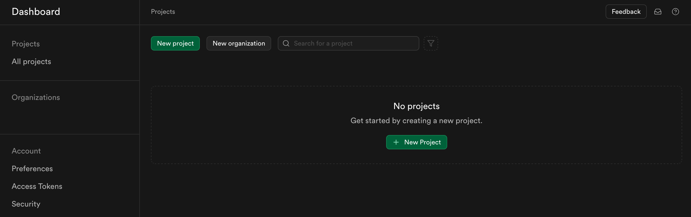
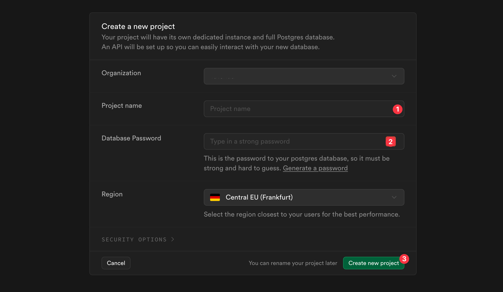
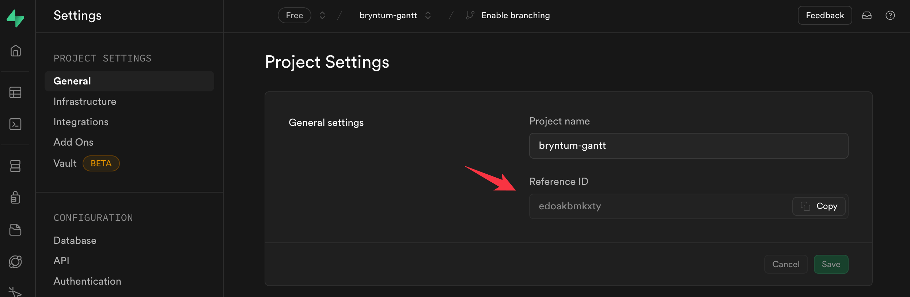
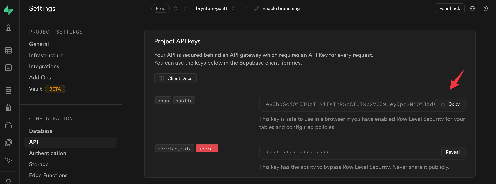
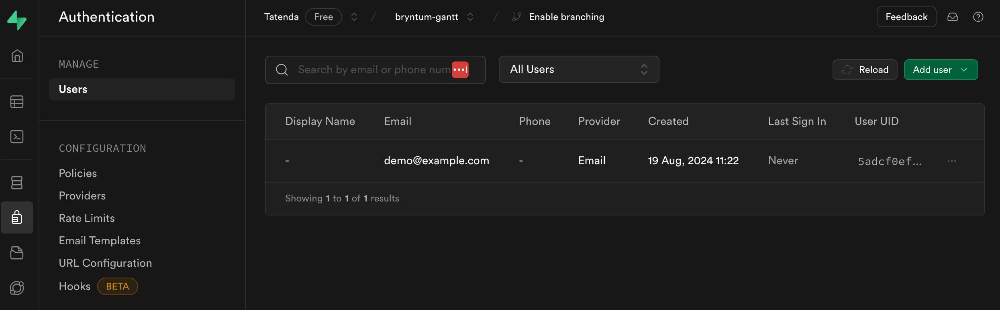
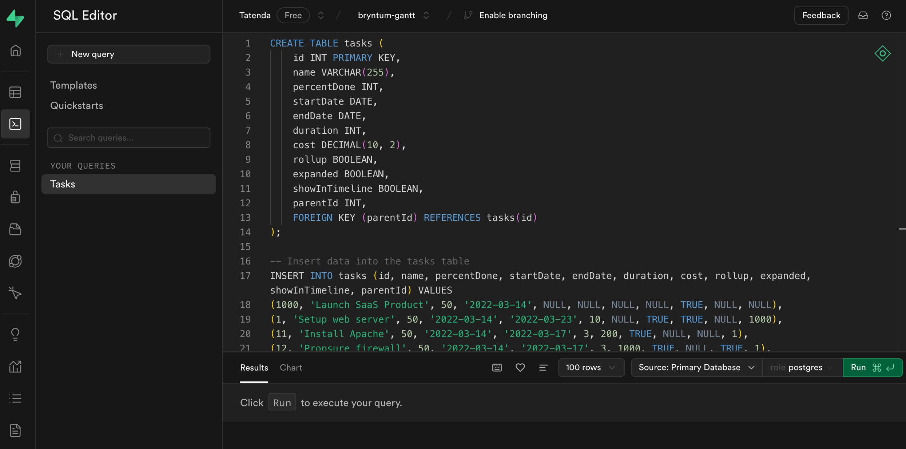
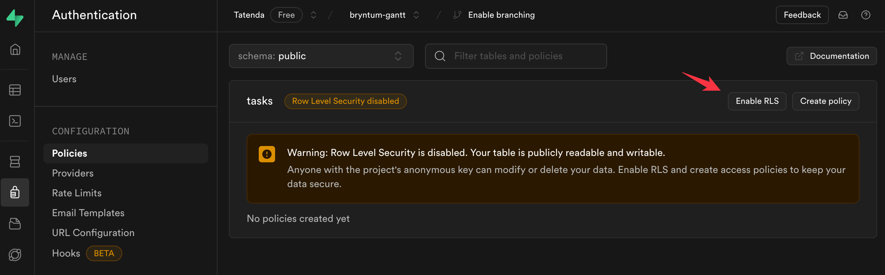
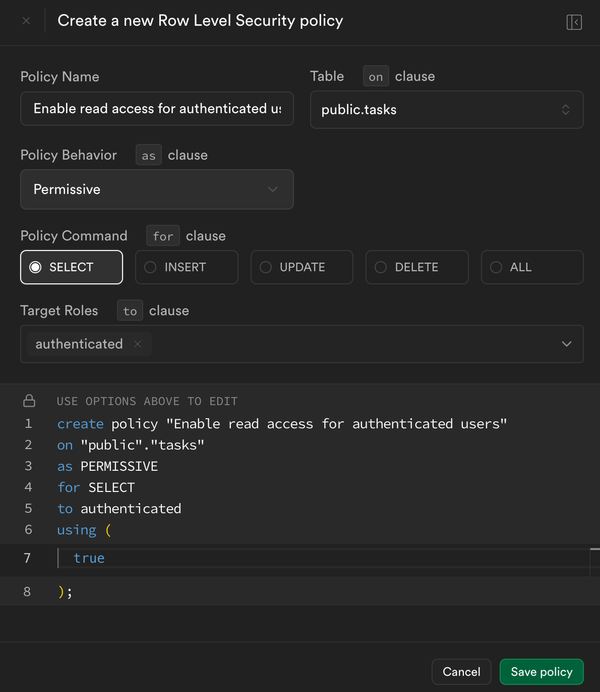
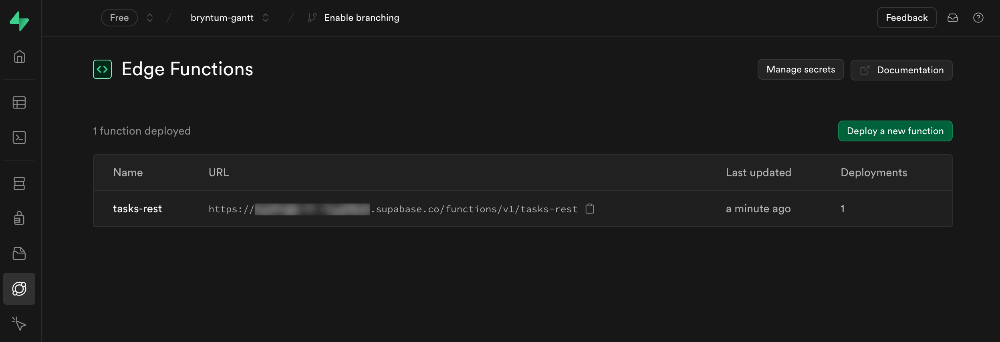

# How to use Supabase Edge Functions to build a Bryntum Gantt chart in React

The [Bryntum Gantt](https://bryntum.com/products/gantt/) is a feature-rich and performant component for creating interactive Gantt charts in web applications. 

In this post, we'll show you how to integrate Bryntum Gantt with a Supabase Postgres database. We'll use Supabase Edge Functions to interact with the database and Supabase Auth with row-level security (RLS) enabled for authorization.

## Prerequisites

To follow along with this guide, you'll need:

- A Supabase account. Create one [here](https://supabase.com/dashboard/sign-in?returnTo=%2Fprojects).
- A running React app. Use our quickstart guide [here](https://bryntum.com/products/gantt/docs/guide/Gantt/quick-start/react) to set up a Bryntum Gantt React project.
- A Bryntum Gantt license, or [sign up for a free trial version](https://bryntum.com/download/).

## Create a Supabase project

In your Supabase organization dashboard, click **New project** to create a new project.



Give your project a name, set a password for the database, select a region, and click **Create new project**.



We'll need a reference ID and API key for the new project.

Find the reference ID in the project settings under **General**.



To find the API key, select **API** from the sidebar. We need the `anon` `public` project API key.



## Create a new Supabase user

Navigate to the **Authentication** tab and click **Add user** to create a new user.



Take note of the new user's email and password to use later.

## Create a new database table

Navigate to the SQL Editor tab.



Click **+ New query** from the sidebar and paste the following SQL commands into the editor:

```sql
CREATE TABLE tasks (
    id INT PRIMARY KEY,
    name VARCHAR(255),
    percentDone INT,
    startDate DATE,
    endDate DATE,
    duration INT,
    cost DECIMAL(10, 2),
    rollup BOOLEAN,
    expanded BOOLEAN,
    showInTimeline BOOLEAN,
    parentId INT,
    FOREIGN KEY (parentId) REFERENCES tasks(id)
);

-- Insert data into the tasks table
INSERT INTO tasks (id, name, percentDone, startDate, endDate, duration, cost, rollup, expanded, showInTimeline, parentId) VALUES
(1000, 'Launch SaaS Product', 50, '2022-03-14', NULL, NULL, NULL, NULL, TRUE, NULL, NULL),
(1, 'Setup web server', 50, '2022-03-14', '2022-03-23', 10, NULL, TRUE, TRUE, NULL, 1000),
(11, 'Install Apache', 50, '2022-03-14', '2022-03-17', 3, 200, TRUE, NULL, NULL, 1),
(12, 'Propsure firewall', 50, '2022-03-14', '2022-03-17', 3, 1000, TRUE, NULL, TRUE, 1),
(13, 'Setup load balancer', 50, '2022-03-14', '2022-03-17', 3, 1200, TRUE, NULL, NULL, 1),
(14, 'Propsure ports', 50, '2022-03-14', '2022-03-16', 2, 750, TRUE, NULL, NULL, 1),
(15, 'Run tests', 0, '2022-03-21', '2022-03-23', 2, 5000, TRUE, NULL, NULL, 1),
(2, 'Website Design', 60, '2022-03-23', '2022-04-13', NULL, NULL, TRUE, TRUE, NULL, 1000),
(21, 'Contact designers', 70, '2022-03-23', '2022-03-30', 5, 500, TRUE, NULL, NULL, 2),
(22, 'Create shortlist of three designers', 60, '2022-03-30', '2022-03-31', 1, 1000, TRUE, NULL, NULL, 2),
(23, 'Select & review final design', 50, '2022-03-31', '2022-04-02', 2, 1000, TRUE, NULL, TRUE, 2),
(24, 'Inform management about decision', 100, '2022-04-04', '2022-04-04', 0, 500, TRUE, NULL, NULL, 2),
(25, 'Apply design to web site', 0, '2022-04-04', '2022-04-13', 7, 11000, TRUE, NULL, NULL, 2),
(3, 'Setup Test Strategy', 20, '2022-03-14', NULL, NULL, NULL, NULL, TRUE, NULL, 1000),
(31, 'Hire QA staff', 40, '2022-03-14', '2022-03-19', 5, 6000, NULL, NULL, NULL, 3),
(33, 'Write test specs', 9, '2022-03-21', NULL, 5, NULL, NULL, TRUE, NULL, 3),
(331, 'Unit tests', 20, '2022-03-21', '2022-04-02', 10, 7000, NULL, NULL, TRUE, 33),
(332, 'UI unit tests / individual screens', 10, '2022-03-21', '2022-03-26', 5, 5000, NULL, NULL, TRUE, 33);
```

Click **Run** to run the queries, and a `tasks` table will be created and populated with some data.

## Enable RLS on the new table

Let's enable RLS on the new table. In the **Authentication** tab, select **Policies** from the sidebar. Click **Enable RLS** for the new table.



Now click **Create policy**. In the dialog that opens, give the new policy a name and click **Save policy**



This policy allows only authenticated users to read the data in the table. Users can be assigned policies that dictate their access to specific rows in tables.

You'll need to follow the same process for every table you add that you would like authenticated users to access. Tables with RLS enabled and no policies assigned will not allow any user except the superuser to access the table data.

## Use Supabase CLI to develop an Edge Function

You can use the Supabase CLI to manage instances, develop and deploy projects, handle migrations, and generate native data types. 

Access the Supabase CLI in your shell environment using package managers for macOS, Windows, Linux, and npm or Bun. This guide assumes you're using npm as your package manager. For other package managers, consult the [Supabase CLI documentation](https://supabase.com/docs/guides/cli/getting-started?queryGroups=platform&platform=macos#installing-the-supabase-cli), but the basics will remain the same.

Let's use the Supabase CLI to create a new Edge Function.

To create a new Supabase project, run the following command from your terminal inside the directory you want your project to live:

```sh
npx supabase init
```

Now create a new Edge Function:

```sh
npx supabase functions new tasks-rest
```

Open the `functions/tasks-rest/index.ts` file that was just created, clear everything, and add the following:

```ts
import { createClient, SupabaseClient } from 'jsr:@supabase/supabase-js@2'

const corsHeaders = {
  'Access-Control-Allow-Origin': '*',
  'Access-Control-Allow-Headers': 'authorization, x-client-info, apikey',
  'Access-Control-Allow-Methods': 'POST, GET, OPTIONS, PUT, DELETE',
}

interface Task {
  name: string
  status: number
}
```

You configured CORS headers to allow cross-site traffic, authorization headers, and the `POST`, `GET`, `OPTIONS`, `PUT`, and `DELETE` methods. This allows us to use this Edge Function as a RESTful API that can be called using the URL. You will see this once you have deployed the function to your Supabase project.

Now add the following code:

```ts
async function getTask(supabaseClient: SupabaseClient, id: string) {
  const { data: task, error } = await supabaseClient.from('tasks').select('*').eq('id', id)
  if (error) throw error 
  
  return new Response(JSON.stringify({ task }), {
    headers: { ...corsHeaders, 'Content-Type': 'application/json' },
    status: 200,
  })
}
```

Here you defined an async function that accepts an `id` parameter and uses the Supabase client to run the appropriate `select` query and returns the response or throws an error.

Add methods for all the verbs in a request:

```ts
async function getAllTasks(supabaseClient: SupabaseClient) {
  // Query the tasks table
  const { data: tasks, error: taskError } = await supabaseClient.from('tasks').select('*')

  if (taskError) throw taskError

  return new Response(JSON.stringify({ tasks }), {
    headers: { ...corsHeaders, 'Content-Type': 'application/json' },
    status: 200,
  })
}

async function deleteTask(supabaseClient: SupabaseClient, id: string) {
  const { error } = await supabaseClient.from('tasks').delete().eq('id', id)
  
  if (error) throw error

  return new Response(JSON.stringify({}), {
    headers: { ...corsHeaders, 'Content-Type': 'application/json' },
    status: 200,
  })
}

async function updateTask(supabaseClient: SupabaseClient, id: string, task: Task) {
  const { error } = await supabaseClient.from('tasks').update(task).eq('id', id)

  if (error) throw error

  return new Response(JSON.stringify({ task }), {
    headers: { ...corsHeaders, 'Content-Type': 'application/json' },
    status: 200,
  })
}

async function createTask(supabaseClient: SupabaseClient, task: Task) {
  const { error } = await supabaseClient.from('tasks').insert(task)

  if (error) throw error

  return new Response(JSON.stringify({ task }), {
    headers: { ...corsHeaders, 'Content-Type': 'application/json' },
    status: 200,
  })
}
```

Next, add the code to start the [Deno](https://supabase.com/blog/edge-runtime-self-hosted-deno-functions) runtime and set up the Supabase client using the current user authorization headers:

```ts
Deno.serve(async (req) => {
  const { url, method } = req
  if (req.method === 'OPTIONS') {
    return new Response('ok', { headers: corsHeaders })
  }
  
  try {
    const supabaseClient = createClient(
      // Supabase API URL - env var exported by default.
      Deno.env.get('SUPABASE_URL') ?? '',
      // Supabase API ANON KEY - env var exported by default.
      Deno.env.get('SUPABASE_ANON_KEY') ?? '',
      // Create client with Auth context of the user that called the function.
      // This way your row-level-security (RLS) policies are applied.
      {
        global: {
          headers: { Authorization: req.headers.get('Authorization')! },
        },
      }
    )
```

Here you use environment variables and the `Authorization` header from the request to get the values to create the context for the client.

Finally, let's add a request handler function: # NOTE: this 'let's' makes me nervous

```ts
    const token = req.headers.get('Authorization')?.replace('Bearer ', '') ?? ''
    const taskPattern = new URLPattern({ pathname: '/tasks-rest/:id' })
    const matchingPath = taskPattern.exec(url)
    const id = matchingPath ? matchingPath.pathname.groups.id : null
    const {
      data: { user },
    } = await supabaseClient.auth.getUser(token)

    let task = null

    if (method === 'POST' || method === 'PUT') {
      const body = await req.json()
      task = body.task
    }

    switch (true) {
      case id && method === 'GET':
        return getTask(supabaseClient, id as string)
      case id && method === 'PUT':
        return updateTask(supabaseClient, id as string, task)
      case id && method === 'DELETE':
        return deleteTask(supabaseClient, id as string)
      case method === 'POST':
        return createTask(supabaseClient, task)
      case method === 'GET':
        return getAllTasks(supabaseClient)
      default:
        return new Response(JSON.stringify({ user }), {
          headers: { ...corsHeaders, 'Content-Type': 'application/json' },
          status: 200,
        })
    }
  } catch (error) {
    return new Response(JSON.stringify({ error: error.message }), {
      headers: { ...corsHeaders, 'Content-Type': 'application/json' },
      status: 400,
    })
  }
})
```

This function gets the bearer token for authorization, sets up a URL pattern to parse the incoming request, and then uses the Supabase Auth library to authorize the current user based on the bearer token. It then calls the relevant function based on the given verb in a request.

Generate the CLI access token by logging in:

```sh
npx supabase login
```

Now you can deploy the Edge Function to your Supabase project:

```sh
npx supabase functions deploy tasks-rest --project-ref <Project_Ref_Id>
```

Replace `<Project_Ref_Id>` with your Supabase project reference ID.

Navigate to your Supabase instance and you should see your new Edge Function deployed:



Here you can see the URL you can use to access your Edge Function. 

Edge functions run server-side in your Supabase instance and enforce the security policies you stipulate to give you secure, low-latency access to the data stored in your Postgres database. Edge Functions can be configured in various ways and are easily adapted to perform a range of tasks or processes using any table or combination of tables.


## Add Bryntum Gantt to the React application

Now you can add Bryntum Gantt to your React application. If you don't have an existing React application ready, [these](https://bryntum.com/products/gantt/docs/guide/Gantt/quick-start/react) instructions should get you started quickly. 

First, in your application's directory, configure npm to download the Bryntum packages in the `@brytum` scope from the Bryntum registry by following the instructions in our documentation [here](https://bryntum.com/products/gantt/docs/guide/Gantt/npm-repository).


Bryntum Gantt uses [Sass](https://sass-lang.com/) to apply CSS rules. Install the `sass` package now if you don't already have it:

```shell
npm install sass
```

Install the Bryntum React package:

```shell 
npm install @bryntum/gantt @bryntum/gantt-react
```

Finally, install the Supabase React Auth UI:

```sh
npm install @supabase/supabase-js @supabase/auth-ui-react @supabase/auth-ui-shared
```

Your application is now set up to use the Supabase login component and Bryntum Gantt.

## Connect to the Supabase Edge Function

Create a new utilities directory:

```sh
mkdir utils
```

Navigate into the new directory:

```sh
cd utils
```

Add a new JavaScript file named `supabaseClient.js` inside the directory and paste the following into it, replacing `<Project_Ref_Id>` and `<Supabase_Anonymous_Key>` with your Supabase values:

```js
import { createClient } from '@supabase/supabase-js'

export const supabase = createClient(
  process.env.REACT_APP_SUPABASE_URL ?? 'https://<Project_Ref_Id>.supabase.co',
  process.env.REACT_APP_SUPABASE_ANON_KEY ??
    '<Supabase_Anonymous_Key>'
)
```

Here you configured the client connection to the Supabase project, which will be used for all interactions with the Supabase instance. You'll use this client to call our edge function/s.

Navigate back to the root of your React project:

```shell
cd ../..
```

Change to the `src` directory:

```shell
cd src
```

Find your `main.jsx` file and replace its contents with the following:

```js
import React from 'react';
import ReactDOM from 'react-dom/client';
import App from './App';
import { Auth } from '@supabase/auth-ui-react'
import { supabase } from './utils/supabaseClient'

const root = ReactDOM.createRoot(document.getElementById('root'));
root.render(
  <React.StrictMode>
    <Auth.UserContextProvider supabaseClient={supabase}>
      <App />
    </Auth.UserContextProvider>
  </React.StrictMode>
);
```

This code imports the `supabaseClient` you created, adds the Supabase React Auth UI as the user context provider, and launches the app.

Still in your `src` directory, replace everything in the `App.jsx` file with the following:

```js
import './App.scss';
import './index.css'
import { useState, useEffect } from 'react'
import { supabase } from './utils/supabaseClient'
import { Auth } from '@supabase/auth-ui-react'
import { ThemeSupa } from '@supabase/auth-ui-shared'
import { BryntumGantt } from '@bryntum/gantt-react';
import { gantt } from './ganttChart';

function App() {
  const [session, setSession] = useState(null)

  useEffect(() => {
    supabase.auth.getSession().then(({ data: { session } }) => {
      setSession(session)
    })
  
    const {
      data: { subscription },
    } = supabase.auth.onAuthStateChange((_event, session) => {
      setSession(session)
    })
    return () => subscription.unsubscribe()
  }, [])

  if (!session) {
    return (<div style={{display: 'flex',  justifyContent:'center', alignItems:'center', height: '100vh'}}>
            <Auth supabaseClient={supabase} appearance={{ theme: ThemeSupa }} />
          </div>)
  }
  else {
    return (
    <div style={{ height: '100%', justifyContent: 'space-around', alignContent: 'center'}}>
      <BryntumGantt {...gantt} />
      <button
        onClick={() => supabase.auth.signOut()}
      >
        Sign out
      </button>
    </div>)
  }
}

export default App;
```

Here's what this code does:

- Presents the user with the Supabase React Auth UI login screen for authentication.
- Directs authenticated users to the Gantt chart component. You'll configure this component in the next section.
- Displays a button to sign out the current user.

Still in the `src` directory, add a `GanttConfig.js` file containing the following code:

```js
import { supabase } from './utils/supabaseClient'  

// Call our edge function
const { data, error } = await supabase.functions.invoke("task-rest", {"name":"Functions"})
if (error) alert(error)
  console.log(data.responseData)

const tasks = data.responseData.tasks;

const gantt = {
  viewPreset : 'weekAndDayLetter',
  barMargin  : 10,
  project : {
      tasks: tasks,
      autoLoad: true,
      autoSetConstraints : true
  }
};

export { gantt};
```

Here you invoke the edge function you previously created using the Supabase Client, unpack the response into the Gantt components' properties, and return these properties to the calling component to be used to display the Gantt chart. #NOTE: this sentence is a bit wak

Now you can run the application with:

```shell
npm run dev
```

You should receive a response similar to the following:

```shell
VITE v5.4.2  ready in 215 ms

  ➜  Local:   http://localhost:5173/
  ➜  Network: use --host to expose
  ➜  press h + enter to show help
```

Visit the URL of the application in your browser, and you should see the login screen you created using the Supabase React Auth UI:


Log in to the application with the credentials for the user you created when you set up the Supabase project. You should see the new Bryntum Gantt chart created by querying the data from your edge function:


You can sign out of the application by clicking the **Sign Out** button below the chart.


