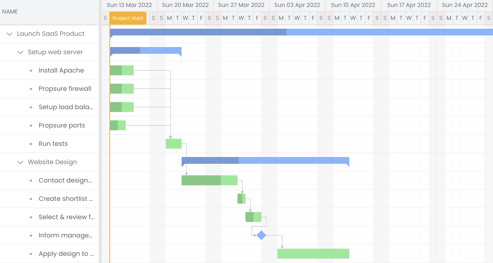

# Bryntum Gantt with Supabase edge functions starter

This repository contains a sample Bryntum Gantt React application.




## Getting started 

Clone the repository and install the project dependencies.

```
npm install
```

Install the Bryntum Gantt component using npm. First, get access to the Bryntum private npm registry by following [this guide](https://www.bryntum.com/products/gantt/docs/guide/Gantt/npm-repository). When you've logged in to the registry, install the Bryntum Gantt component by following [this guide](https://www.bryntum.com/products/gantt/docs/guide/Gantt/quick-start/react#install-bryntum-gantt-packages).


Now you can run the application with:

```shell
npm run dev
```